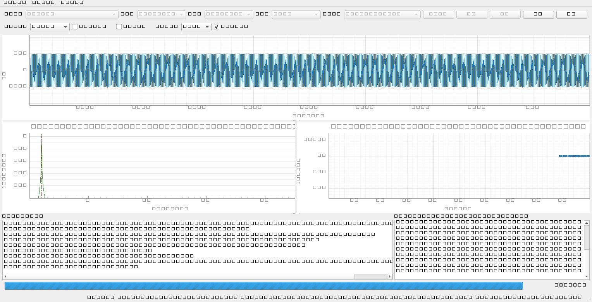
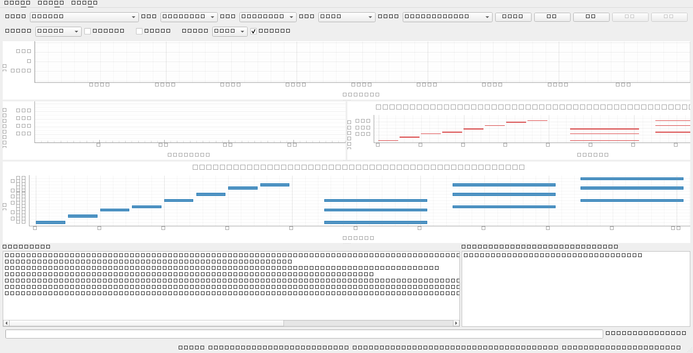

# zpyaudio

音频分析软件：对麦克风或音频文件做**实时**分析，显示波形时序图、1/16 秒刷新的频谱图与主频率时序图，
并在主频读数旁给出**音名**；录制结束后把本次主频时序导出为 CSV。
打开 **MIDI** 时进入**符号分析**：显示钢琴卷帘，并在主频区域画出音符频率曲线。

需求规格书：`docs/requirements.md`（v0.5）。

## 当前进度

| 里程碑 | 内容 | 状态 | 验收 |
| --- | --- | --- | --- |
| M0 | 环境与骨架：目录结构、配置、日志、CLI、测试骨架 | ✅ 完成 | `pytest` 全绿、`--self-test` 能起窗口 |
| M1 | 最小原型：麦克风采集 → 波形 + 频谱 + 主频 P1 | ✅ 完成 | A1、A2、A3 |
| M2 | 主频 P2（谐波积谱）/ P3（YIN）+ 主频时序图 | ✅ 完成 | A1、A2、A6 |
| M3 | wav/mp3 解码与播放、录制写盘、暂停/继续/拖动 | ✅ 完成 | A4、A5 |
| M4 | GUI 控件全量、菜单、进度条、恢复默认设置、异常提示 | ✅ 完成 | A8、FR-6.3 |
| M4.1 | **v0.5 变更**：主频音名、日志右侧数据区、录制导出主频时序 CSV | ✅ 完成 | A10、A11、A12 |
| M5 | **MIDI 符号分析**：解析 → 钢琴卷帘 + 音符频率曲线 | ✅ 完成 | A7 |
| M6 | 覆盖率补强、PyInstaller 打包 | ⬜ 待开始 | NFR-6/7、A9 |



由 `python main.py --self-test --demo-tone 1000 --self-test-shot images/m4_gui_windows.png` 生成（1 kHz 合成正弦）：
波形幅度 ±0.5、频谱峰值 996.1 Hz（裸 bin）/ 主频 1000.2 Hz（插值后）、主频时序图为对数频率轴上的 1 kHz 直线；
底部左侧为日志区、**右侧为 v0.5 新增的主频时序数据区（约 1/3 宽，逐帧显示 时间/频率/音名/置信度）**，
菜单栏、视图选项、进度条与状态栏读数（含音名 `B5`）一致。



M5：由 `python main.py --self-test --demo-midi --self-test-shot images/m5_gui_midi.png` 生成（演示 MIDI：
C 大调音阶 + C/F/G 三个和弦）。**区域④为钢琴卷帘**（横轴时间、纵轴音高、左轴直接标音名：音阶是一串阶梯，
和弦是三层叠起来的横条），**区域③由声学主频切换为「符号数据」**——红色阶梯是按
`f = 440×2^((n-69)/12)` 画出的音符频率曲线，标题明确写着"不是声学主频"；
右下数据区为空（它是声学口径的 时间/频率/音名/置信度，MIDI 没有声学帧）。

## 环境

| 项 | 值 |
| --- | --- |
| 解释器 | `C:\miniconda3\envs\ibase\python.exe`（Python 3.13.16） |
| 依赖 | 见 `requirements.txt`（numpy / scipy / PySide6 / pyqtgraph / sounddevice / soundfile / mido） |
| 外部程序 | `C:\ffmpeg\bin\ffmpeg.exe`（mp3 等有损格式解码；缺失时给出中文指引，wav 不受影响） |

> ⚠️ 直接执行 `python` 会命中 Windows 应用商店占位符，请使用上面的绝对路径，或先 `conda activate ibase`。

## 运行

```powershell
$py = "C:\miniconda3\envs\ibase\python.exe"

# 正常启动（选择输入设备后点「开始」监听；「录制」边录边分析；「打开文件」播放并分析）
& $py main.py

# 无麦克风时：用 1 kHz 合成正弦验证波形/频谱/主频（验收 A1）
& $py main.py --demo-tone 1000

# 列出可用输入设备
& $py main.py --list-devices

# 无界面端到端自检（合成 1 kHz，判定主频偏差 ≤ 2 Hz）
& $py main.py --audio-check 3
& $py main.py --audio-check 3 --source device     # 用真实麦克风

# 文件播放自检（A5：真实声卡输出 + 进度偏差 + 播放欠载）
& $py main.py --file-check path\to\music.mp3 --file-check-seconds 5

# MIDI 符号分析自检（A7：钢琴卷帘数据 + C4 频率 + 与 mido 的消息数一致性）
& $py main.py --midi-check path\to\song.mid

# 打开一段内置演示 MIDI（C 大调音阶 + 三个和弦），无需外部素材
& $py main.py --demo-midi

# 离屏起窗口自检（CI/无桌面环境），可顺带保存布局截图
& $py main.py --self-test --self-test-ms 800
& $py main.py --self-test --demo-tone 1000 --self-test-shot images/shot.png
& $py main.py --self-test --demo-midi --self-test-shot images/m5_gui_midi.png

# 详细日志
& $py main.py --log-level DEBUG
```

日志落盘于 `logs/zpyaudio_YYYYmmdd_HHMMSS.log`；配置保存在 `config.json`
（缺失或损坏时自动回退默认值，非法取值自动纠正，界面「视图 → 恢复默认设置」可一键复位）。

录制（F6）结束后，除 wav 外还会在同目录生成**与 wav 同名的 CSV**（主频时序，UTF-8 BOM）：
列头 `t_s,freq_hz,freq_smoothed_hz,note,cents,confidence,rms_dbfs,method`，只写有有效主频的帧，
Excel / pandas 可直接打开。写在失败时会在日志与对话框中给出中文提示，wav 不受影响。

界面快捷键：`Ctrl+O` 打开文件、`F5` 开始、`F6` 录制、`F7` 暂停/继续、`F8` 停止。

## 架构

```text
音频输入源 ──► 环形缓冲 RingBuffer ──► 分析线程(每 62.5 ms) ──► 有界快照队列 ──► GUI 定时器重绘
（设备回调 / 合成源 / 文件源）        （core.analyzer）        (maxsize=4)      （只画图）
      └──► 块回调 ──► 录制写盘线程（wav） / 播放输出（sounddevice.OutputStream）
```

| 目录 | 职责 |
| --- | --- |
| `core/` | 数据结构、环形缓冲、重采样、频谱与主频算法（P1/P2/P3）、主频轨迹平滑、**音名换算（`notes.py`）**、**主频时序收集与 CSV 导出（`pitch_series.py`）**（**不依赖 GUI**） |
| `sources/` | 输入源：`device_source`、`synthetic_source`、`file_source`（准实时推进 + seek + 暂停） |
| `media/` | `decoder`（soundfile / ffmpeg 子进程）、`player`（播放线程）、`recorder`（写盘线程）、**`midi_loader`（mido → 音符事件）、`midi_render`（M7 预留接口）** |
| `app/` | 配置、日志、状态机与线程编排（`controller`）、命令行（`cli`） |
| `gui/` | 主窗口、波形/频谱/主频/日志视图、**主频时序数据区（`pitch_data_view`）、钢琴卷帘（`pianoroll_view`）**、视图选项、进度条、控制条（**不做 FFT、不做文件 IO**） |

关键设计取舍：

- **分析跳步固定 1/16 s（62.5 ms）**，窗长默认 4096（48 kHz 下 85.3 ms，约 27% 重叠）；
  裸 FFT 分辨率 11.7 Hz 无法满足 ±5 Hz 精度，故主频默认用**抛物线插值**。
- **主频三档**：P1 谱峰+插值（默认）、P2 谐波积谱（二次谐波比基频强 14 dB 时仍能还原基频）、
  P3 YIN（80 Hz 等低频下误差 < 1 Hz，远优于 Δf）。
- **音名不是音高**：主频按十二平均律（A4 = 440 Hz）就近命名，同时给**音分偏差**与置信度；
  因 Δf 粗于低音区半音间距，`< 250 Hz` 的读数标注"仅供参考"（界面用 `*`）。
- **主频时序只有一份来源**：分析线程把每帧推入 `PitchSeries`（最近 2000 点供界面增量显示、
  录制时保留全量点供导出），主频图、数据区、状态栏、CSV 都取自它——GUI 定时器丢帧只影响显示，
  不会让导出的 CSV 缺行。
- **录制结束导出**：与 wav 同名的 `records/*.csv`（UTF-8 BOM，ASCII 列头
  `t_s,freq_hz,freq_smoothed_hz,note,cents,confidence,rms_dbfs,method`），只写有效主频帧；
  写失败只提示，不影响 wav 收尾。
- **回调线程不加锁、不分配**：环形缓冲用「写序号校验 + 有限重试」的近似无锁方案。
- **对数坐标轴自绘**（`gui/log_axis.py`）：pyqtgraph 的 `setLogMode` 只对曲线做 log10 映射，
  散点/标线不映射，混用会画错，因此统一由调用方传 log10 + 自定义刻度标签。
- **播放预填**：起播前先把播放队列填到接近满，并把节拍基准回拨预填时长，
  否则源会干等一个预填时长导致欠载（实测 9 次 → 0 次）。
- **静音门限 −60 dBFS**：低于门限不输出主频，避免静音时的虚假读数。
- **ffmpeg 只用于有损格式与重采样**：wav/flac/ogg 走 soundfile；需要重采样时交给 ffmpeg
  （逐块 `resample_poly` 会在块边界产生周期性失真）。

M5 追加：

- **MIDI 是符号数据，不进状态机**：它没有音频、不能播放，所以只作为"当前打开的一份文档"
  挂在控制器上；任何一次真实采集/播放都会自动清掉它，从而天然保证
  "钢琴卷帘只在 MIDI 时显示"（规格书 7.1 区域④）。
- **tick → 秒必须自己按 tempo map 换算**。`mido` 逐轨迭代给出的 `Message.time` 单位是
  **tick**；迭代整个 `MidiFile` 才是秒，但那样拿不到轨道号，而 FR-4.1 要求事件带 `track`。
  照抄 `msg.time` 的后果是"卷帘整体被拉长几百倍"，肉眼很难当场发现。
- **音符配对用队列，不用字典覆盖**：同一 `(channel, note)` 上重叠的多次 `note_on`
  必须逐个配对，否则踏板/长音段落会直接丢音符，`note_on` 计数也就对不上
  （而"解析结果与 mido 消息数一致"正是 FR-4.1 的验收方式）。
- **`note_on velocity=0` 是松键**（MIDI 惯例），轨末未闭合的音符按轨末闭合、不丢弃。
- **符号模式复用主频区域但语义完全不同**：横轴从"最近 N 秒"变成"0…曲长"，标题必须带
  "符号数据"并写明"不是声学主频"；一旦有声学帧进来就自动退回声学模式，避免两套数据混画。
- **符号曲线与音名共用一份公式**：`core/notes.note_frequency()` 既供音名换算，也供
  FR-4.3 的音符频率曲线，避免出现两套 `f = 440×2^((n-69)/12)`。

## 测试

```powershell
& $py -m pytest                      # 333 项，全绿
& $py -m pytest tests/test_analyzer.py -v           # A1 / A6 判据
& $py -m pytest tests/test_notes.py -v              # A10 音名换算
& $py -m pytest tests/test_pitch_series.py -v       # A11 序列收集与 CSV 格式
& $py -m pytest tests/test_controller_media.py -v   # A4 / A5 / A11 / A12 判据
& $py -m pytest tests/test_midi_loader.py -v        # M5：FR-4.1 / FR-4.3 / FR-4.5
& $py -m pytest tests/test_gui_midi.py -v           # M5：FR-4.2 / FR-4.4 与 A7 的界面路径
```

播放相关用例使用 `tests/fakes.py` 的 `FakePlayer`，无需声卡即可验证「解码 → 分析 → 播放队列」链路。

`pytest.ini` 关闭了 `tmpdir` 与 `cacheprovider` 插件（受限环境下系统临时目录不可写、
`.pytest_cache` 重命名被拒），需要临时目录的用例改用 `tests/conftest.py` 的 `work_dir` 夹具。

## 状态机

`IDLE → MONITORING / RECORDING / PLAYING → PAUSED → … → IDLE`；非法迁移被忽略并记入 DEBUG 日志。
`ERROR` 仅作为异常回滚的中间态（弹窗/日志提示后立即回到 `IDLE`）。

## 后续（M6）

- M6：覆盖率补强、长时间运行（A9）、PyInstaller 打包（NFR-7）。
- M7（可选）：MIDI → 音频——`media/midi_render.py` 的 `MidiRenderer` 接口已经就位
  （当前 `render()` 抛"未实现"），接入 FluidSynth + SoundFont 后渲染出 PCM，
  再作为普通 `AudioFrame` 进入现有管线即可复用波形/频谱/主频三张图。
